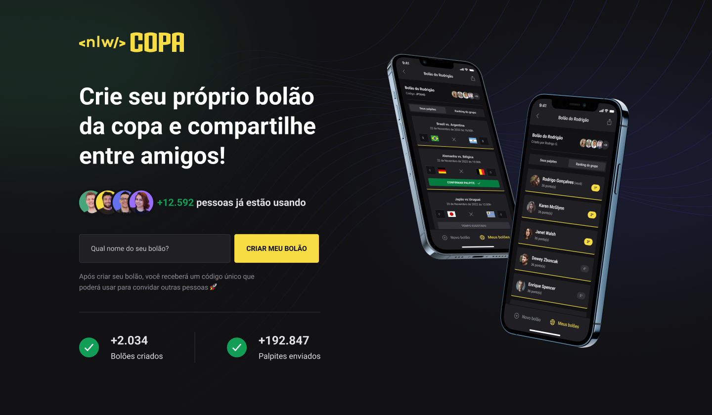

<h1 align="center">
    
</h1>

<h4 align="center"> 
	:heavy_check_mark:  Next Level Week Copa ⚽🚀 Done! :heavy_check_mark:
</h4>
<p align="center">
  

<a href="https://www.linkedin.com/in/fellipeutaka/">
    
  </a>

<a aria-label="Completed" href="https://lp.rocketseat.com.br/nlw">
    </img>
  </a>

<a href="https://github.com/fellipeutaka/nlw-copa/commits/master">
    
  </a>


   <a href="https://github.com/fellipeutaka/nlw-copa/stargazers">
    
  </a>
</p>
<p align="center">
  <a href="#-nlw">Next Level Week</a>   |   
  <a href="#-project">Project</a>   |   
  <a href="#rocket-Technologies">Technologies</a>   |   
  <a href="#-layout">Layout</a>   |   
  <a href="#-how-to-use">How to use</a>   |   
  <a href="#-how-to-contribute">How to contribute</a>   |   
  <a href="#memo-license">License</a>   |   
  <a href="https://fellipeutaka-nlwcopa.vercel.app/">Live demo</a>
</p>

## ℹ️ What's Next Level Week?

NLW is a practical week with lots of code, challenges, networking and a single objective: to take you to the next level.
Through our method you will learn new tools, learn about new technologies and discover hacks that will boost your career.
An online and completely free event that will help you take the next step in your evolution as a dev.

### Stages

- Stage 1: Base Building - ✔️
  - Starting and configuring the development environment with Node, React and React Native.
- Stage 2: Routes - ✔️
  - Creating API routes and connecting front-end to our backend.
- Stage 3: Layout and UI - ✔️
  - Creating some screens on mobile app.
- Stage 4: Consuming API - ✔️
  - Using axios on mobile app to fetch data from backend.
- Stage 5: Final Round - ✔️
  - Finalizing the mobile app features.

## 💻 Project

Bolão da Copa (FIFA World Cup Sweepstake, like a predict-the-score game) is a web and mobile platform that people can play a predict-the-score game and share with your friends.

<h1 align="center">
    
</h1>

<h1 align="center">
    
</h1>

## 🚀 Technologies

This project was developed with the following technologies:

- [TypeScript][ts]
- [Node.js][node]
- [Prisma][prisma]
- [SQLite][sqlite]
- [React][react]
- [Next.js][next]
- [TailwindCSS][tailwind]
- [React Native][rn]
- [Expo][expo]

## 🔖 Layout

To access the layout use [Figma][figma].

## ℹ️ How To Use

To clone and run this application, you'll need [Git](https://git-scm.com), [Node.js][node] + [Yarn][yarn] installed on your computer.

From your command line:

```bash
# Clone this repository
$ git clone https://github.com/fellipeutaka/nlw-copa.git

# Install dependencies
$ yarn

# Generate Prisma Client types
$ yarn server prisma generate

# Start server
$ yarn dev
```

## 🤔 How to contribute

1. Fork this repository.
2. Create a branch: `git checkout -b <branch_name>`.
3. Make your changes and commit them: `git commit -m '<commit_message>'`
4. Push to original branch: `git push origin <project_name> / <local>`
5. Create the pull request.

Or, see the GitHub documentation on [how to create a pull request](https://help.github.com/en/github/collaborating-with-issues-and-pull-requests/creating-a-pull-request).

## 📝 License

This project is under the MIT license. See the [LICENSE](https://github.com/fellipeutaka/nlw-copa/blob/master/LICENSE) for details.

Made with ♥ by Fellipe Utaka 👋 [Get in touch!](https://www.linkedin.com/in/fellipeutaka/)

[figma]: https://www.figma.com/file/kwLAEZmyDB2NuvMNi87XGF/Bol%C3%A3o-da-Copa-(Community)
[node]: https://nodejs.org/
[prisma]: https://www.prisma.io/
[sqlite]: https://www.sqlite.org/index.html
[ts]: https://www.typescriptlang.org/
[expo]: https://expo.dev/
[react]: https://reactjs.org
[next]: https://nextjs.org/
[tailwind]: https://tailwindcss.com/
[rn]: https://reactnative.dev/
[yarn]: https://yarnpkg.com/
